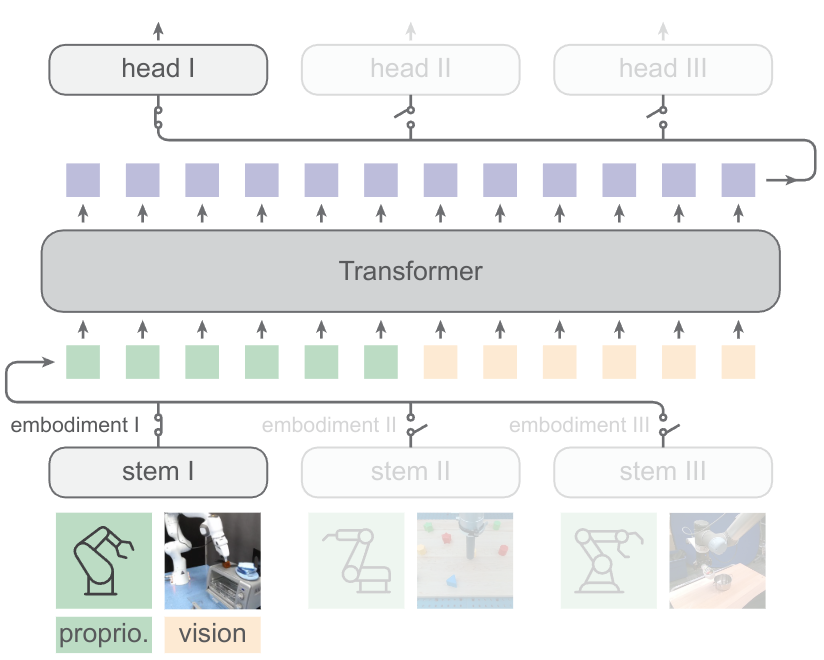

# 🦾 Heterogenous Pre-trained Transformers
[](https://huggingface.co/liruiw/hpt-base)
[](LICENSE)
[](http://arxiv.org/abs/2409.20537)
[](https://liruiw.github.io/hpt)
[]()
[]()

[Lirui Wang](https://liruiw.github.io/), [Xinlei Chen](https://xinleic.xyz/), [Jialiang Zhao](https://alanz.info/), [Kaiming He](https://people.csail.mit.edu/kaiming/)

Neural Information Processing Systems (Spotlight), 2024


<hr style="border: 2px solid gray;"></hr>


This is a pytorch implementation for pre-training Heterogenous Pre-trained Transformers (HPTs). The pre-training procedure train on mixture of embodiment datasets with a supervised learning objective. The pre-training process can take some time, so we also provide pre-trained checkpoints below. You can find more details on our [project page](https://liruiw.github.io/hpt). An alternative clean implementation of HPT in Hugging Face can also be found [here](https://github.com/liruiw/lerobot/).


**TL;DR:** HPT aligns different embodiment to a shared latent space and investigates the scaling behaviors in policy learning. Put a scalable transformer in the middle of your policy and don’t train from scratch!


## ⚙️ Setup
1. ```pip install -e .```


<details>
<summary><span style="font-weight: bold;">Install (old-version) Mujoco</span></summary>

```
mkdir ~/.mujoco
cd ~/.mujoco
wget https://mujoco.org/download/mujoco210-linux-x86_64.tar.gz  -O mujoco210.tar.gz --no-check-certificate
tar -xvzf mujoco210.tar.gz

# add the following line to ~/.bashrc if needed
export LD_LIBRARY_PATH=$LD_LIBRARY_PATH:${HOME}/.mujoco/mujoco210/bin
export LD_LIBRARY_PATH=$LD_LIBRARY_PATH:/usr/lib/nvidia
export LD_LIBRARY_PATH=$LD_LIBRARY_PATH:/usr/local/cuda/lib64
export MUJOCO_GL=egl
```

</details>

## 🚶 Usage
0. Check out ``quickstart.ipynb`` for how to use the pretrained HPTs.
1. ```python -m hpt.run``` train policies on each environment. Add `+mode=debug`  for debugging.
2. ```bash experiments/scripts/metaworld/train_test_metaworld_1task.sh test test 1 +mode=debug``` for example script.
3. Change ``train.pretrained_dir`` for loading pre-trained trunk transformer. The model can be loaded either from local checkpoint folder or huggingface [repository](https://huggingface.co/liruiw/hpt-xlarge).
4. Run the following scripts for mujoco experiments.

<details>
  <summary><span style="font-weight: bold;">Metaworld 20 Task Experiments</span></summary>

```
bash experiments/scripts/metaworld/train_test_metaworld_20task_finetune.sh hf://liruiw/hpt-base
```
5. See [here](experiments/config/config.yaml) for defining and modifying the hyperparameters.
6. We use [wandb](https://wandb.ai/home) to log the training process.

</details>

## 🤖 Try this On Your Own Dataset
0. For training, it requires a dataset conversion  `convert_dataset` function for packing your own datasets. Check [this](env/realworld) for example.
1. For evaluation, it requires a `rollout_runner.py` file for each benchmark and  a ``learner_trajectory_generator`` evaluation function that provides rollouts.
2. If needed, modify the [config](experiments/configs/config.yaml) for changing the perception stem networks and action head networks in the models. Take a look at [`realrobot_image.yaml`](experiments/configs/env/realrobot_image.yaml) for example script in the real world.
3. Add `dataset.use_disk=True` for saving and loading the dataset in disk.

## 💽 Checkpoints
You can find pretrained HPT checkpoints here. At the moment we provide the following model versions:

| Model                                                                  |   Size         |
|--------------------------------------------------------------------------------|----------------|
| [HPT-XLarge](https://huggingface.co/liruiw/hpt-xlarge)                 |  226.8M Params  |
| [HPT-Large](https://huggingface.co/liruiw/hpt-large)                 |  50.5M Params  |
| [HPT-Base](https://huggingface.co/liruiw/hpt-base)                 |  12.6M Params  |
| [HPT-Small](https://huggingface.co/liruiw/hpt-small)                 |  3.1M Params   |
| [HPT-Base (With Language)](https://huggingface.co/liruiw/hpt-base-lang)       |  50.6M Params  |


---
## 💾 File Structure
```angular2html
├── ...
├── HPT
|   ├── data            # cached datasets
|   ├── output          # trained models and figures
|   ├── env             # environment wrappers
|   ├── hpt             # model training and dataset source code
|   |   ├── models      # network models
|   |   ├── datasets    # dataset related
|   |   ├── run         # transfer learning main loop
|   |   ├── run_eval    # evaluation main loop
|   |   └── ...
|   ├── experiments     # training configs
|   |   ├── configs     # modular configs
└── ...
```

### 🕹️ Citation
If you find HPT useful in your research, please consider citing:
```
@inproceedings{wang2024hpt,
author    = {Lirui Wang, Xinlei Chen, Jialiang Zhao, Kaiming He},
title     = {Scaling Proprioceptive-Visual Learning with Heterogeneous Pre-trained Transformers},
booktitle = {Neurips},
year      = {2024}
}
```


## Contact

If you have any questions, feel free to contact me through email (liruiw@mit.edu). Enjoy!




